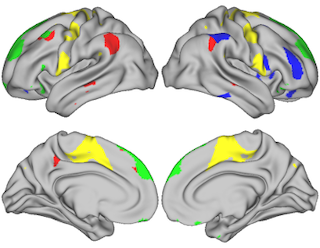
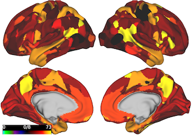

# VISUALIZATION OF BRAIN SURFACE DATA

This package provides the functionality of visualizing data on a standard brain surface. This package leverages brain visualization functionality available in the connectome workbench made available as part of the Human Connectome Project [1]. 

This package provides two visualization options:
1.	Visualize selected regions of interest on the brain surface (see Fig 1)
2.	Visualize a desired metric for each region in a brain parcellation (see Fig 2)
3. Visualize a desired metric for each voxel in a brain parcellation
4. Visualize a brain surface from data contained in a dscalar file




*Figure 1: Visualizing 100 regions from ICA parcellation.*



*Figure 2: Visualizing multipole membership values for all regions in ICA parcellation.*

## Requirements

Operating systems: Linux, OS X

Software: 
 - Workbench Command [2] that can be called using *$wb_command*
 - For option 2 and 3: 
      - Julia v"1.0.x" with PyCall (v"1.91.4" tested)
      - Python 3.x with nibabel (v"3.1.1" tested), numpy (v"1.18.2" tested)

## Usage
**1. Option 1**

   How to run:
   
   ```
   $chmod +x plotSelectedRegions.sh

   $./plotSelectedRegions.sh input_file dlabel_file scene_file [output_file] [img_width] [img_height]
   ```

   Input:
   - **input_file** : the text file (.txt) that contains the index of each region to be highlighted (option 1) or the value of each region (option 2).
         
         Option 1: to highlight the regions of indices 2, 39, 45, the content of **input_file** shall consist of the following 3 lines:
         
                  2
                  39                  
                  45
                  
         Option 2: for a parcellation with n regions, the *input_file* shall consist of n rows only, in which row i represents the value of region i.
   - **dlabel_file** : the dlabel file (*.dlabel.nii*) of the parcellation
   - **scene_file** : the scene file that specifies the background input files (*.surf.gii* for left and right hemispheres) and the view angle of the image
   - **output_file** (optional): the name (with path) of the output image. When this parameter is not provided, the output image will be saved as brain_image.png in ../
   - **img_width** (optional): the width of the output image in pixel. Default: 900
   - **img_height** (optional): the height of the output image in pixel. Default: 700
   
   Output:
   - Image file has the name specified by *output_file* if given or *brain_image.png*, otherwise

**2. Option 2**

   How to run
   
   ```
   $julia plotRegionValues.jl val_file dlabel_file dscalar_file 
   ```
   
   Input:
   - **val_file** : text file (*.txt*) that has on each row the pair of region index and value separated by ',' 
   - **dlabel_file** : the standard dlabel file (*.dlabel.nii*) of the parcellation 
   - **dscalar_file** : the standard dscalar file (*.dscalar.nii*) of the parcellation
   
   Output:
   - Image file named *brain_image.png* in the current folder
   
**3. Option 3**

   How to run
   
   ```
   $julia plotVoxelValues.jl val_file dlabel_file dscalar_file 
   ```
   
   Input:
   - **val_file** : text file (*.txt*) that has on each row the pair of voxel index and value separated by ',' 
   - **dlabel_file** : the standard dlabel file (*.dlabel.nii*) of the parcellation 
   - **dscalar_file** : the standard dscalar file (*.dscalar.nii*) of the parcellation
   
   Output:
   - Image file named *brain_image.png* in the current folder
   
**4. Option 4**

   How to run
   
   ```
   $./plotDscalar.sh input_file scene_file [output_file] [img_width] [img_height]
   ```
   
   Input:
   - **input_file** : input dscalar file (*.dscalar.nii*)
   - **scene_file** : the scene file that specifies the background input files (*.surf.gii* for left and right hemispheres) and the view angle of the image
   - **output_file** (optional): the name (with path) of the output image. When this parameter is not provided, the output image will be saved as brain_image.png in ../
   - **img_width** (optional): the width of the output image in pixel. Default: 900
   - **img_height** (optional): the height of the output image in pixel. Default: 700
   
## References

[1] Human Connectome Project. https://www.humanconnectome.org

[2] Workbench. https://www.humanconnectome.org/software/workbench-command
